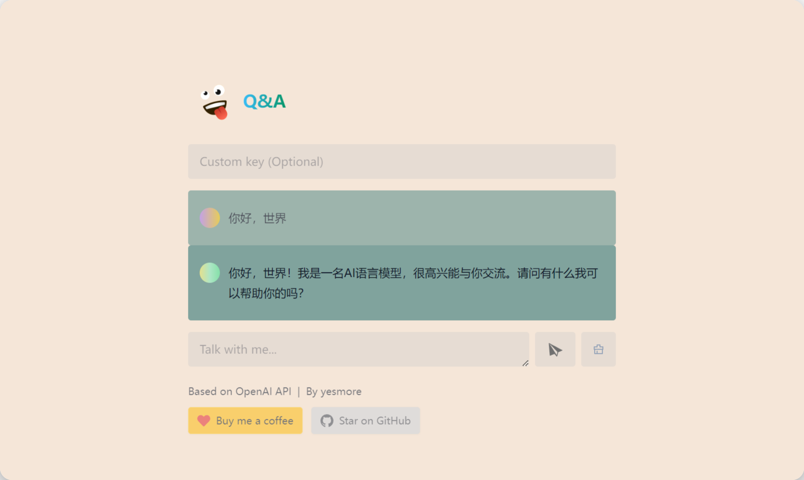

# QAChat

> [QAChat Pro](https://aka.qachat.pro) 已经上线~ 

与 AI 对话，基于 ChatGPT [OpenAI GPT-3.5 Turbo API](https://platform.openai.com/docs/guides/chat)，并提供免费体验密钥，支持自定义 OpenAI API 密钥。

在线体验：[https://qachat.cc](https://qachat.cc) (国内)；[https://qachats.vercel.app](https://qachats.vercel.app/) (国外)

> tip：欢迎加入 <a href='https://t.me/yesmore_cc'></a> 与喵娘聊天~（集成ChatGPT机器人）



## 特性

- 快得批爆
- 支持自定义 OpenAI API 密钥
- 支持随机生成预设场景（100+）
- 支持缓存会话

特别提供预设文件（中/英文），方便开发者集成:

**源文件**

- [prompts.json](https://github.com/yesmore/QA/blob/main/src/data/prompts.json)
- [prompts-zh.json](https://github.com/yesmore/QA/blob/main/src/data/prompts-zh.json)

**Api调用**

- [https://nb.js.cn/prompts](https://nb.js.cn/prompts)
- [https://nb.js.cn/prompts-zh](https://nb.js.cn/prompts-zh)

> Api 会请求 Github 仓库源文件，速度比较慢，可下载源文件自部署接口。

## 环境变量

> 请先将文件 `.env.example` 重命名为 `.env`, 并填写 `OPENAI_API_KEY` 变量值（此处申请[OpenAI](https://platform.openai.com/account/api-keys)）。
> 
> 如果需要本地开发，请填写http代理 `HTTPS_PROXY` 变量。


| 变量                  | 描述                           | 示例                           |
| --------------------- | ------------------------------ | ------------------------------ |
| `OPENAI_API_BASE_URL` | Custom base url for OpenAI API | `https://api.openai.com`       |
| `OPENAI_API_KEY`      | Custom OpenAI API Key          | `sk-eawsgfwegwaqeqtq234516512` |
| `HTTPS_PROXY`         | Provide proxy for OpenAI API   | `http://127.0.0.1:7890`        |
| `SECRET_KEY`          | Secret string for the project  | `123456`                       |
| `HEAD_SCRIPTS`        | HTML Scripts                   |                                |
| `CODE`        | 授权码 (提供免费密钥且设置CODE值，则激活授权模式)               | `123,124,125`               |

## 本地调试

```bash
git clone https://github.com/yesmore/QA.git

cp .env.example .env

pnpm i
# 本地 Node.js 版本必须大于 18.+
pnpm dev
```

## 部署

#### Vercel (推荐)

[](https://vercel.com/new/clone?repository-url=https%3A%2F%2Fgithub.com%2Fyesmore%2FQA&env=OPENAI_API_KEY&envDescription=OpenAI%20API%20Key&envLink=https%3A%2F%2Fplatform.openai.com%2Faccount%2Fapi-keys)

#### Netlify

[](https://app.netlify.com/start/deploy?repository=https://github.com/yesmore/QA#OPENAI_API_KEY=&HTTPS_PROXY=&OPENAI_API_BASE_URL=&HEAD_SCRIPTS=&SECRET_KEY=&OPENAI_API_MODEL=&SITE_PASSWORD=)

**分步部署教程：**

- [Fork](https://github.com/yesmore/QA/fork) 此项目，前往 [https://app.netlify.com/start](https://app.netlify.com/start) 新建站点，选择你 `fork` 完成的项目，将其与 `GitHub` 帐户连接。
- 选择要部署的分支，选择 `main` 分支， 在项目设置中配置环境变量，环境变量配置参考下文。
- 选择默认的构建命令和输出目录，单击 `Deploy Site` 按钮开始部署站点。


#### 部署在更多的服务器

请参考官方部署文档：https://docs.astro.build/en/guides/deploy

## 参考

- [chatgpt-demo](https://github.com/ddiu8081/chatgpt-demo)
- [Awesome ChatGPT Prompts](https://prompts.chat/)
- [ChatGPT 中文调教指南](https://chatguide.plexpt.com/)

## License 

[GPL](./LICENSE) © [yesmore](https://github.com/yesmore)

<a href="https://www.buymeacoffee.com/yesmore/gallery" target="_blank"></a>
